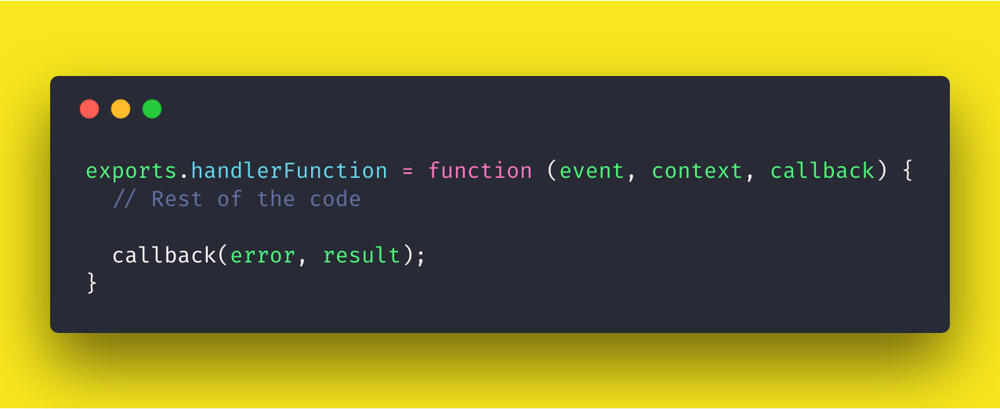

# How to Build a Serverless Backend with AWS Lambda and Node.js

*Get familiar with function-as-a-service (FaaS), deploy a demo on a AWS Lambda serverless computing platform, hook up a MongoDB database-as-a-service to a serverless REST API, and more.*

[origin](https://medium.com/crowdbotics/how-to-build-a-serverless-backend-with-aws-lambda-and-nodejs-e0d1257086b4)

Serverless architecture is a cloud computing execution model where a cloud provider like AWS, Azure or Google Cloud is used to deploy backend or server-side code. In comparison to traditionally deployed web applications, in serverless architecture, the developer does not has to maintain the servers or the infrastructure. They only have to pay a subscription to the third party vendor whereas the vendor is responsible to handle the operation of the backend logic of a server along with scalability, reliability, and security.

There are two ways a serverless architecture can be implemented in order to deploy your server-side code. First one is Backend as a Service or BaaS. A good example of this is Firebase which you can often see in conjunction between a web or a mobile application to a database or providing user authentication.
What we are going to focus in this article is called Function as a Service or FaaS. With FaaS, the server code is run inside containers that are usually triggered by common events such as HTTP requests from the client, database operations, file uploads, scheduled events and so on. The code on the cloud provider that is deployed and getting executed is in the form of a function.

In FaaS, these functions are deployed in modular form. One function corresponds to each operation, thus eliminating the rest of the code and time spent on writing boilerplate code for setting up a server and data models. These modular functions can further be scaled automatically and independently. This way, more time can be spent on writing the logic of the application that a potential user is going to interact with. You do not have to scale for the entire application and pay for it. Common use cases of FaaS so far have been implemented are scheduled tasks (or cron jobs), automation, web applications, and chatbots.

Common FaaS service platform providers are:

- AWS Lambda
- Google Cloud Functions
- Microsoft Azure Functions
- Apache OpenWhisk

In the following tutorial, we are going to create a demo to deploy on a serverless infrastructure provider such as AWS Lambda.

## What is AWS Lambda

In order to build and deploy a backend function to handle a certain operation, I am going to start with setting up the service provider you are going to use to follow this article. AWS Lambda supports different runtimes such as Node.js, Java, Python, .NET Core and Go for you to execute a function.
The function runs inside a container with a 64-bit Amazon Linux AMI. You might be thinking, ‘why I am telling you all of this?’ Well, using serverless for the first time can be a bit overwhelming and if you know what you are getting in return, that’s always good! More geeky stuff is listed below.

- Memory: 128MB — 3008MB
- Ephemeral disk space: 512MB
- Max execution duration: 300 seconds
- Compressed package size: 50MB
- Uncompressed package size: 250MB

The execution duration here means that your Lambda function can only run a maximum of 5 minutes. This does mean that it is not meant for running longer processes. The disk space is the form of a temporary storage. The package size refers to the code necessary to trigger the server function. In case of Node.js, this does mean that any dependencies that are being imported into our server (for example, node_modules/ directory).

A typical lambda function in a Node.js server will look like below.



In the above syntax, ```handlerFunction``` is the name of our Lambda function. The ```event``` object contains information about the event that triggers the lambda function on execution. The ```context``` object contains information about the runtime. Rest of the code is written inside the Lambda function and at last a ```callback``` is invoked with an error object and result object. We will learn more about these objects later when are going to implement them.

## Setting up AWS Lambda

In order to setup a Lambda function on AWS, we need to first register an account for the access keys. Use your credentials to login or signup a new account on console.amazon.com and once you are through the verification process you will be welcomed by the following screen.


To get the keys and permissions in order to deploy a function, we have to switch to Identity and Access Management (IAM). Then go to ```Users``` tab from the left hand sidebar and click on the button ```Add user```. Fill in the details in the below form and do enable ```Access Type > Programmatic Access```.


Then on the next page, select ```Attach Existing Policies Directly``` and then select a policy name ```AdministratorAccess```.


Click ```Next: Review``` button and then click ```Create User``` button when displayed. Proceeding to the next step you will see the user was created. Now, and only now, will you have access to the users Access Key ID and Secret Access Key. This information is unique for every user you create.

## Creating a Serverless Function

We are going to use install an npm dependency first to proceed and scaffold a new project. Open up your terminal and install the following.

```npm install -g serverless```

Once installed, we can run the serverless framework in the terminal by running the command:

```serverless```

Or use the shorthand ```sls``` for ```serverless```. This command will display all the available commands that come with the serverless framework.


After installing the ```serverless``` dependency as a global package, you are ready to create your first function. To start, you will need to configure your AWS registered user credentials. AWS gives you a link to download access keys when creating a user.


You can also visit your username and visit Security Credentials like below.


Now let us configure AWS with the serverless package.

```sls config credentials --provider aws --key ACCESS_KEY --secret SECRET_KEY```

If the above command runs successfully you will get a success message like below


The good thing about using ```serverless``` npm package is that it comes with pre-defined templates that you can create in your project using a command and also creates a basic configuration for us that is required to deploy our Lambda function. To get started, I am going to use ```aws-nodejs``` template inside a new directory.

```sls create -t aws-nodejs -p aws-serverless-demo && cd aws-serverless-demo```

The ```-p``` flag will create a new directory with name ```aws-serverless-demo```. The ```-t``` flag uses the pre-defined boilerplate. The result of this will create three new files in your project directory.

- Usual .gitignore
- handler.js where we will write our handle function
- serverless.yml contains the configuration

The default handler file looks like below.

```javascript
module.exports.hello = async (event, context) => {
	return {
		statusCode: 200,
		body: JSON.stringify({
			message: 'Go Serverless v1.0! Your function executed successfully!',
			input: event
		})
	};
};
```

In the above file, hello is the function that has two parameters: ```event```, and ```context```. ```module.exports``` is basic Nodes syntax as well as the rest of the code. You can clearly see it also supports ES6 features. An ```event``` is an object that contains all the necessary request data. The ```context``` object contains AWS-specific values. We have already discussed it before. Let us modify this function to our needs and add a third parameter called the ```callback```. Open ```handler.js``` file and edit the ```hello``` function.

```javascript
'use strict';

module.exports.hello = (event, context, callback) => {
	console.log('Hello World');
	callback(null, 'Hello World');
};
```

The ```callback``` function must be invoked with an ```error``` response as the first argument, in our case it is ```null``` right now or a valid response as the second argument which is currently sending a simple ```Hello World``` message. We can now deploy this handler function using the command below from your terminal window.

```sls deploy```

It will take a few minutes to finish the process. Our serverless function gets packed into a ```.zip``` file. Take a notice at the **Service Information** below. It contains all the information what endpoints are available, what is our function, where it is deployed and so on.


You can try the ```invoke``` attribute like following to run the function and see the result.

The output will look like below.


Take a look at the configuration in serverless.yml.

```javascript
service: aws-nodejs
provider:
  name: aws
  runtime: nodejs8.10
functions:
  hello:
    handler: handler.hello

 ```

 